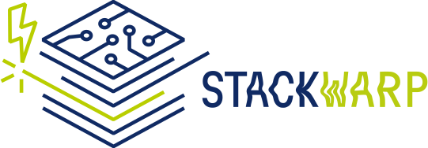

StackWarp is a security vulnerability that exploits a synchronization bug present in all AMD Zen 1–5 processors. 
In the context of SEV-SNP, this flaw allows malicious VM hosts to manipulate the guest VM’s stack pointer. 
This enables hijacking of both control and data flow, allowing an attacker to achieve remote code execution and privilege escalation inside a confidential VM.

## Research Paper
Refer to the StackWarp [website](https://stackwarpattack.com) for details, demos, and the research paper published at USENIX Security 2026.


You can cite our work with the following BibTeX entry:
```latex
@inproceedings{Zhang2026StackWarp,
 author = {Ruiyi Zhang and Tristan Hornetz and Daniel Weber and Fabian Thomas and Michael Schwarz},
 booktitle = {USENIX Security},
 title = {{StackWarp: Breaking AMD SEV-SNP Integrity via Deterministic Stack-Pointer Manipulation through the CPU’s Stack Engine}},
 year = {2026}
}
```

To prevent immediate weaponization, we have omitted end-to-end exploit chains. 
Instead, we provide the materials, including PoCs, microbenchmarks, KVM patch (WIP), and our MSR-space fuzzer:

1. `poc`: Manual StackWarp triggering only via Command-line.
2. `simple-poc`: A minimal poc to validate StackWarp on the host microarchitecture.
3. `ucode-instr-num`: Analyzing stack instruction uop counts under Stack Engine variance.
4. `architectural_tests`: Observing architectural state shifts triggered by systematic MSR toggling to discover StackWarp.
5. `rsa_crt`: RSA Bellcore Attack
6. `openssh-exploit`: OpenSSH Gadget Analysis.
7. `getuid-exploit`: Sudo Gadget Analysis.
8. `kernel_rce`: Kernel ROP Chain Analysis.


## Mitigation
AMD has tracked the issue as CVE-2025-29943 and provided a microcode update fixing the vulnerability. 
For more detailed information, we recommend reading the official [AMD Security Bulletin](https://www.amd.com/en/resources/product-security/bulletin/amd-sb-3027.html).


## Disclaimer
We are providing this code as-is. 
You are responsible for protecting yourself, your property and data, and others from any risks caused by this code. 